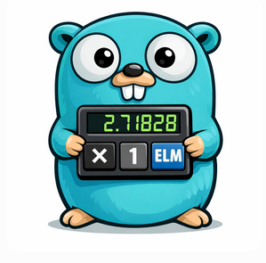

# EML inspired stack based programming language

All elementary functions from a single operator for golang



[Whitepaper](https://arxiv.org/pdf/2603.21852)

# Euler's constant

```go
	var euler = &EmlProgram{&EML, &ONE, &ONE}
	println(euler.Evaluate(1337))
```

# Negate the input number

```go
	var negate = &EmlProgram{&EML, &EML, &ONE, &EML, &ONE, &EML, &ONE, &EML, &EML, &ONE, &ONE, &ONE, &EML, EXX, &ONE}
	println(negate.Evaluate(1))
```

# Calculate the reciprocal

```go

	var reciprocal = &EmlProgram{&EML, &EML, &EML, &ONE, &EML, &ONE, &EML, &ONE, &EML, &EML, &ONE, &ONE, &ONE, EXX, &ONE}
	println(reciprocal.Evaluate(5))
```